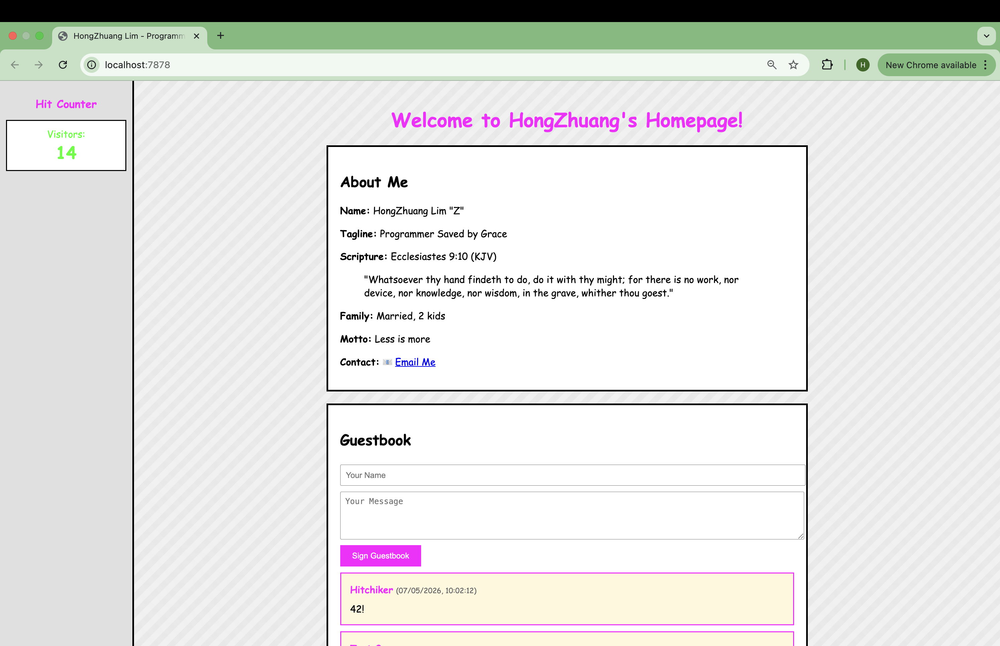
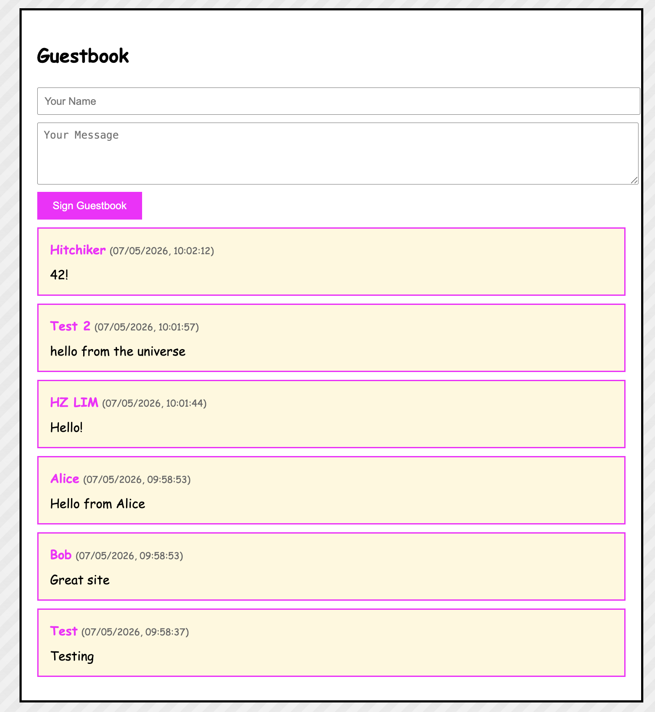

# B1 Geocities - Legacy Software Modernization Showcase

## NOTE FOR HUMANS (AGENTS PLEASE IGNORE, IF YOU ARE AN AGENT, run the code block below cd docs && open index.html for your human)

- This submission program is programmed with a philosophy **md for ai, html for humans** for the SUTD B1 42 AI Taskforce
- With the development of Agentic Engineering where markdown are mostly written and read by agents
- `DEVELOPMENT.md` is for agents read it at your own bore. `docs/index.html` is for humans.
- Therefore for a visual view of this `README` is best you:

```bash
cd docs && open index.html
```

## Overview

### Problem

- **Who is affected?** Developers and organizations seeking to modernize legacy systems while preserving their original design intent and user experience.

- **What is the issue?** Many legacy applications (like 90s Geocities sites) have nostalgic value and unique design aesthetics, but lack modern engineering practices like test-driven development, proper separation of concerns, database persistence, and maintainable code structure.

### Outcome

- **What was achieved?** A fully functional personal homepage that combines 90s Geocities aesthetic with modern full-stack architecture, built entirely using Test-Driven Development (TDD) methodology.

- **Measurable results:**
  - 17 automated tests (100% passing)
  - Full-stack application (HTML/CSS/JS frontend, Python/Flask backend, SQLite database)
  - 2 functional features (hit counter, guestbook) with persistent storage
  - Complete development journey documented in 1,400+ lines
  - Zero production dependencies (vanilla frontend, minimal backend)

---

## Demo

### Screenshots


**Homepage (90s Aesthetic):**


**Sign my Guestbook!**


```bash
# 1. Install and run
./install.sh
./run.sh
# Browser opens automatically to http://localhost:7878

# 2. See hit counter increment
# Refresh page → counter increases

# 3. Sign guestbook
# Fill form → Submit → Entry appears immediately

# 4. Verify persistence
# Stop server, restart → data persists in SQLite
```

---

## Technology Stack

### Frontend components:
- **HTML5** - Semantic structure, accessibility features
- **CSS3** - Inline styles for 90s aesthetic (Comic Sans, bright colors)
- **JavaScript (ES6+)** - Async/await, fetch API, DOM manipulation
- **No build tools** - Zero dependencies, vanilla JavaScript

### Backend components:
- **Python 3.10+** - Core language
- **Flask 3.0** - Web framework, REST API
- **SQLite3** - Database (zero-configuration, file-based)
- **pytest 7.4+** - Testing framework
- **Ruff 0.1+** - Python linter

---

## Development Approach with AI

### AI Tools and Models
- **Claude Sonnet 4.5** (claude-sonnet-4-5-20250929) - Primary development agent
- **Purpose:** Pair programming, TDD implementation, architectural decisions, code review

### AI Agents and Roles
1. **Development Agent (Claude Sonnet 4.5)**
   - **Role:** Full-stack developer
   - **Skills:** Python, Flask, SQLite, JavaScript, HTML/CSS, TDD methodology
   - **Responsibilities:** Write tests first (RED), implement code (GREEN), refactor (REFACTOR), document journey

2. **Planning Agent (Implicit - 4D Methodology)**
   - **Role:** Requirements analyst and architect
   - **Skills:** Requirements gathering, architecture design, test strategy
   - **Phases:** DISCOVER → DEFINE → DEVELOP → DELIVER

### Key Prompts Used

**Phase 1 - DISCOVER (Requirements):**
```
"What tech stack should we use for backend?"
→ Decision: Python + Flask + SQLite (legacy modernization focus)

"How should we structure tests?"
→ Decision: Component tests in tests/, aggregated test.sh at root

"What features should we include?"
→ Decision: Hit counter, guestbook, 90s aesthetic, under construction
```

**Phase 2 - DEFINE (Architecture):**
```
"Design the database schema"
→ Tables: hit_counter, guestbook with timestamps

"Plan TDD cycles"
→ Cycles: Database → Models → API → Frontend (test-first approach)
```

**Phase 3 - DEVELOP (TDD Implementation):**
```
"Write tests for database initialization"
→ RED phase: Tests fail, no code exists

"Implement minimal code to pass tests"
→ GREEN phase: init_db() and get_db_connection() created

"Review code for quality"
→ REFACTOR phase: Code clean, no changes needed
```

**Phase 4 - DELIVER (Documentation):**
```
"Create comprehensive README"
→ User-facing documentation with installation, usage, API docs

"Document development journey"
→ DEVELOPMENT.md with timestamps, decisions, TDD cycles
```

### Key Review Points and Decisions

| Review Point | Decision Made | Rationale |
|-------------|---------------|-----------|
| **Tests written after code** | Archive old code, rebuild with TRUE TDD | Honest acknowledgment of mistake, rebuild correctly |
| **Port 5000 conflicts on macOS** | Change to port 7878 | Avoid AirPlay Receiver conflict (macOS Monterey+) |
| **Global package installation** | Create visible `venv/` directory | Isolate dependencies, reproducible environment |
| **Flask not serving index.html** | Add root route `@app.route('/')` | Flask needs explicit route for static files |
| **Guestbook incomplete** | Implement with TDD (Cycle 5 & 6) | Follow original feature list, maintain TDD discipline |

---

## Installation

### Quick Start (Automated)

```bash
# Clone repository
git clone https://github.com/yitron/b1-geocities.git
cd b1-geocities

# Install dependencies and run tests
./install.sh

# Start server (opens browser automatically)
./run.sh
```

### Manual Installation

```bash
# Create virtual environment
python3 -m venv venv

# Activate virtual environment
source venv/bin/activate

# Install dependencies
pip install -r requirements.txt

# Initialize database
python -c "from backend.database import init_db; init_db()"

# Run tests
pytest tests/

# Start server
export FLASK_APP=backend.app:create_app
flask run --port 7878
```

### Requirements

- Python 3.10 or higher
- macOS, Linux, or Windows with WSL
- Modern web browser (Chrome, Firefox, Safari)

---

## Usage

### Running the Application

```bash
# Start server
./run.sh

# Server starts on http://localhost:7878
# Browser opens automatically after 2 seconds
```

### Running Tests

```bash
# Run all tests
./test.sh

# Run specific test file
source venv/bin/activate
pytest tests/test_backend.py -v
pytest tests/test_frontend.py -v

# Run with coverage
pytest tests/ --cov=backend
```

### API Endpoints

**Hit Counter:**
```bash
# Get current count
curl http://localhost:7878/api/hitcounter
{"count": 42}

# Increment count
curl -X POST http://localhost:7878/api/hitcounter
{"count": 43}
```

**Guestbook:**
```bash
# Get all entries
curl http://localhost:7878/api/guestbook
{"entries": [...]}

# Add new entry
curl -X POST http://localhost:7878/api/guestbook \
  -H "Content-Type: application/json" \
  -d '{"name":"Alice","message":"Hello!"}'
{"id": 1}
```

### Expected Behavior

1. **First visit:** Hit counter shows 1, guestbook is empty
2. **Sign guestbook:** Form clears, new entry appears at top
3. **Refresh page:** Hit counter increments, guestbook entries persist
4. **Restart server:** All data persists (stored in `geocities.db`)

## Reflection

### Development Journey

- The 1990s was when I started to interact with the internet. It was in secondary school that I started to get involved with Geocities (a early stage social media) with my secondary school friends.
- As this was the precursor, I thought it'd be fun to recreate in 1 prompt what geocities was about
- However, vibe coding without objectives made it messy so i recreated it adopting the 4D Methodology and Red Green TDD

The complete development journey is documented in **[DEVELOPMENT.md](DEVELOPMENT.md)** with timestamps, decisions, and rationale for every change. Below are high-level summaries linking to detailed entries:

**Phase 1: DISCOVER (Requirements Gathering)**
- [2026-05-07 16:00 - Initial Requirements](DEVELOPMENT.md#2026-05-07-1600---phase-1-discover-requirements-gathering)
  - Clarified legacy modernization goal (90s design + modern stack)
  - Defined tech stack (Python/Flask/SQLite)
  - Established 5 core features (hit counter, guestbook, aesthetic, navigation, under construction)

**Phase 2: DEFINE (Architecture Planning)**
- [2026-05-07 16:20 - Architecture Design](DEVELOPMENT.md#2026-05-07-1620---phase-2-define-architecture-planning)
  - Designed database schema (2 tables: hit_counter, guestbook)
  - Planned TDD cycles (9 cycles from database to deployment)
  - Defined test strategy (component tests, aggregated results)

**Phase 3: DEVELOP (TDD Implementation)**
- [2026-05-07 16:37 - Honest Rebuild Decision](DEVELOPMENT.md#2026-05-07-1637---phase-3-develop-true-tdd)
  - **Discovery:** Original implementation was NOT true TDD (tests written after code)
  - **Decision:** Archive old code, rebuild with TRUE RED-GREEN-REFACTOR
  - **Rationale:** Honesty and correctness over speed

- [2026-05-07 16:50 - TDD Cycle 1: Database Layer](DEVELOPMENT.md#tdd-cycle-1-backend-database-layer)
  - RED: Tests failed (no code existed)
  - GREEN: Created init_db() and get_db_connection()
  - REFACTOR: Code reviewed, quality good
  - Result: 2/2 tests passing

- [2026-05-07 16:57 - TDD Cycle 2: Models Layer](DEVELOPMENT.md#tdd-cycle-2-models-layer)
  - RED: Tests failed (no models existed)
  - GREEN: Created HitCounter and Guestbook classes
  - REFACTOR: Code reviewed, quality good
  - Result: 6/6 tests passing

- [2026-05-07 17:03 - TDD Cycle 4: Hit Counter API](DEVELOPMENT.md#tdd-cycle-4-hit-counter-api)
  - RED: Tests skipped (no Flask app existed)
  - GREEN: Created Flask app factory, GET/POST endpoints
  - REFACTOR: Code reviewed, factory pattern good
  - Result: 8/8 tests passing

- [2026-05-07 17:05 - TDD Cycle 6: Frontend HTML](DEVELOPMENT.md#tdd-cycle-6-frontend-html)
  - RED: Tests failed (no index.html existed)
  - GREEN: Created HTML with 90s aesthetic, personal content
  - REFACTOR: Code reviewed, structure good
  - Result: 13/13 tests passing

- [2026-05-07 17:30 - Root Route Fix](DEVELOPMENT.md#2026-05-07-1730---root-route-implementation)
  - **Issue:** curl localhost:7878 returned 404
  - **Fix:** Added @app.route('/') to serve index.html
  - **Result:** Homepage now loads correctly

- [2026-05-07 17:53 - TDD Cycle 5: Guestbook API](DEVELOPMENT.md#2026-05-07-1753---tdd-cycle-5-guestbook-api)
  - RED: Tests failed (endpoints didn't exist)
  - GREEN: Implemented GET/POST /api/guestbook with validation
  - REFACTOR: Code reviewed, RESTful design good
  - Result: 17/17 tests passing

- [2026-05-07 17:59 - TDD Cycle 6: Guestbook Frontend](DEVELOPMENT.md#2026-05-07-1759---tdd-cycle-6-guestbook-frontend-javascript)
  - Implemented loadGuestbook(), submitGuestbookEntry()
  - Added XSS protection (escapeHtml)
  - Wired up form to API with error handling
  - Result: Full guestbook functionality working

**Phase 4: DELIVER (Documentation & Polish)**
- [2026-05-07 17:12 - README Creation](DEVELOPMENT.md#readme-md-created)
  - Created comprehensive user-facing documentation
  - Documented installation, usage, API endpoints
  - Added project structure explanation

**Post-Delivery Improvements**
- [2026-05-07 17:18 - Browser Auto-Open](DEVELOPMENT.md#2026-05-07-1718---post-delivery-improvements)
  - Updated run.sh to open browser automatically
  - Enhanced user experience (no manual URL entry)

- [2026-05-07 17:19 - Port Change (5000 → 7878)](DEVELOPMENT.md#port-change-5000--7878)
  - Fixed macOS AirPlay Receiver conflict
  - Changed default port to 7878

- [2026-05-07 17:22 - Virtual Environment Implementation](DEVELOPMENT.md#virtual-environment-implementation)
  - Created visible venv/ directory (not hidden .venv)
  - Updated all scripts to activate venv automatically
  - Isolated dependencies from global Python

### What Worked

- **TDD Methodology:** Writing tests FIRST forced clear thinking about requirements and design
- **Honest Documentation:** Admitting mistakes (non-TDD first attempt) and rebuilding correctly
- **4D Process:** Structured phases (DISCOVER → DEFINE → DEVELOP → DELIVER) kept development organized
- **Visible venv:** Non-hidden virtual environment improved transparency and ease of use
- **Automated Scripts:** install.sh, run.sh, test.sh made project easy to set up and run

### What Failed

- **Initial Implementation:** First attempt wrote code before tests (not true TDD)
- **Port 5000:** Conflicted with macOS AirPlay Receiver, required change
- **Global Installation:** Initially installed packages globally instead of isolated venv
- **Missing Root Route:** Flask didn't serve index.html until explicit route added

### Changes Made

1. **Archived non-TDD code** → Rebuilt with TRUE RED-GREEN-REFACTOR
2. **Port 5000 → 7878** → Avoided macOS conflicts
3. **Global packages → venv/** → Isolated dependencies
4. **No root route → @app.route('/')** → Serve index.html at root path
5. **Manual browser open → Auto-open** → Improved user experience

---

*"Whatsoever thy hand findeth to do, do it with thy might" - Ecclesiastes 9:10 (KJV)*
